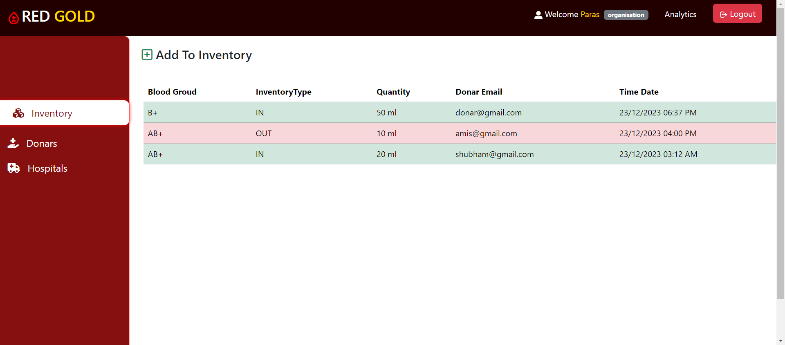

# Blood-Bank-Management-System
Blood-Bank-Management-System

# Blood Bank Management System

Blood Bank is a web application developed using the MERN (MongoDB, Express.js, React, Node.js) stack. It allows users to manage blood donation activities, catering to different roles such as admin, donor, hospital, and organization.

## Features

- **User Roles:**
  - Admin: Manages overall system settings, user roles, and data.
  - Donor: Registers as a blood donor, view personal info and donation logs, and donate blood through Organization.
  - Hospital: Manages blood inventory, requests blood from Organization, tracks consumers.
  - Organization: Coordinates blood donation drives, manages events, and tracks donation statistics.

- **Authentication:**
  - JWT (JSON Web Tokens) are used for secure authentication.
  - Passwords are encrypted using the bcrypt library.

- **Frontend:**
  - Developed using React.js for a dynamic and responsive user interface.
  - State management is handled using Redux Toolkit.
  - Bootstrap and utility components for styling.

- **Backend:**
  - Built with Node.js and Express.js, following the MVC (Model-View-Controller) architecture.
  - MongoDB is used as the database with Mongoose for data modeling.
  - Axios and CORS for handling cross-origin requests and responses.
  - Morgan and colors for request logging and helpful console output.

## Getting Started

### Prerequisites

- Node.js and npm installed on your machine.
- A running MongoDB instance (local or hosted).

### Installation

From the project root:

```bash
# install all dependencies for backend and frontend
npm run install:all
```

Alternatively, install separately:

```bash
# Backend
cd backend
npm install

# Frontend
cd ../frontend
npm install
```

### Environment Variables

- Create a `.env` file in `backend/` with:

```
MONGO_URL=mongodb://127.0.0.1:27017/blood-bank
JWT_SECRET=your_strong_secret
DEV_MODE=development
PORT=8080
```

- Create a `.env` file in `frontend/` (optional if you use the dev proxy) with:

```
REACT_APP_BASEURL=http://localhost:8080/api/v1
```

Notes:
- The frontend `package.json` includes a development proxy to `http://localhost:8080`.
- The frontend API client reads `REACT_APP_BASEURL` (see `frontend/src/services/API.js`).

### Running the Application

From the project root, to run both backend and frontend together in development:

```bash
npm run dev
```

This starts:
- Backend on `http://localhost:8080`
- Frontend on `http://localhost:3000`

Run individually (optional):

```bash
# Backend only
cd backend
npm run dev

# Frontend only
cd frontend
npm start
```

### Production

Build the frontend and start the backend in production mode:

```bash
# from project root
npm run build
npm start
```

### Deployment

#### Backend on Render
1. Push this repository to GitHub/GitLab.
2. In Render, create a new Web Service and connect the repository.
3. Environment:
   - Set `Node` runtime.
   - Add environment variables: `MONGO_URL`, `JWT_SECRET`, `PORT=8080`, `DEV_MODE=production`.
4. Root directory: repository root.
5. Build command:
   ```bash
   npm --prefix backend install
   ```
6. Start command (any one of):
   ```bash
   npm start
   # or
   node backend/server.js
   ```
7. After deploy, note the backend URL, e.g. `https://your-backend.onrender.com`.

Ensure CORS in the backend allows your frontend domain.

#### Frontend on Netlify
1. In Netlify, create a new site from Git (or use CI/CD from the same repo).
2. Set build settings:
   - Base directory: repository root (leave empty).
   - Build command:
     ```bash
     npm --prefix frontend run build
     ```
   - Publish directory: `frontend/build`
3. Environment variables:
   - Set `REACT_APP_BASEURL` to your backend API base, e.g.
     ```
     REACT_APP_BASEURL=https://your-backend.onrender.com/api/v1
     ```
4. Deploy. The site will be available at your Netlify domain.


## Screenshots



